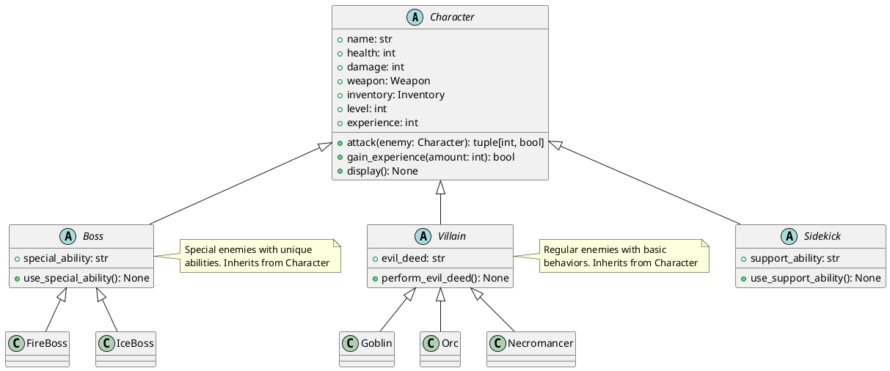

# UML Class Diagram

```plantuml
@startuml

abstract class Character {
    +name: str
    +health: int
    +damage: int
    +weapon: Weapon
    +inventory: Inventory
    +level: int
    +experience: int
    +attack(enemy: Character): tuple[int, bool]
    +gain_experience(amount: int): bool
    +display(): None
}

abstract class Boss {
    +special_ability: str
    +use_special_ability(): None
}

abstract class Villain {
    +evil_deed: str
    +perform_evil_deed(): None
}

abstract class Sidekick {
    +support_ability: str
    +use_support_ability(): None
}

Character <|-- Boss
Character <|-- Villain
Character <|-- Sidekick

Boss <|-- FireBoss
Boss <|-- IceBoss
Villain <|-- Goblin
Villain <|-- Orc
Villain <|-- Necromancer

note right of Boss
    Special enemies with unique
    abilities. Inherits from Character
end note

note right of Villain
    Regular enemies with basic
    behaviors. Inherits from Character
end note

@enduml
```
